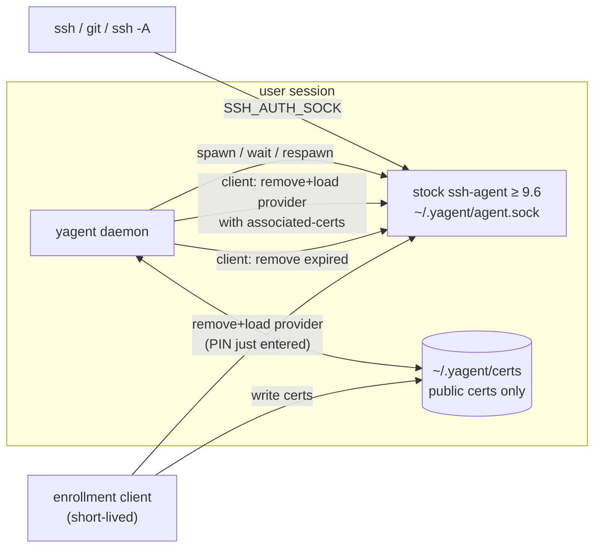

# yagent: a stateless supervisor for a stock ssh-agent

| | |
|---|---|
| Status | Proposal, with a proof of concept in `agent/yagent` and `cmd/yagent` |
| Scope | Client-side agent for hardware-backed (PKCS#11) SSHCA certificates |
| Replaces | The client-side use of `agent/shimagent` and `agent/yubiagent` |

## Summary

Today the client agent is a proxy. `SSH_AUTH_SOCK` points at a shim that wraps
a real ssh-agent, keeps the SSHCA certificates for hardware keys in its own
memory, and rewrites `List` and `Sign` traffic so those certificates appear to
live in the agent.

yagent removes the proxy. `SSH_AUTH_SOCK` points straight at a stock OpenSSH
ssh-agent, and the certificates really do live in it. They are attached to the
PKCS#11 keys with the `associated-certs-v00@openssh.com` constraint, which
OpenSSH added in 9.6. yagent itself is only a daemon. It keeps that agent
running, restores it from on-disk backups after a restart, and removes
certificates when they expire. It never holds a key, a certificate or a PIN in
memory between operations.

## Background

### How the shim works today

```
ssh / enrollment client / remote RA (over agent forwarding)
        │  agent protocol + extension messages 31–36
        ▼
yubiagent server ── slot ops (list/read/attest), Wait, AddHardCert
        └─ shimagent.Server
              certs map[hash]*certificate   ← hard certs live only here
              List   = in-memory certs ∪ agent keys, sorted
              Sign   = map cert → underlying key, forward to agent
              filter = drop orphaned and expired in-memory certs
        ▼
ssh-agent  (bare PKCS#11 keys, soft keys)
```

A stock agent cannot accept a certificate for a key whose private half it
does not hold through `SSH_AGENTC_ADD_IDENTITY`. So the shim keeps
hardware-backed certificates (`AddHardCert`) beside the agent and translates
requests for them. A lot of the complexity follows from that one decision.

- **State lives in two places.** A respawned inner agent comes back without
  the certificates, and a new shim has to be rebuilt around it. The shim had to
  expose its in-memory certificates (`Server.HardCerts`, #262) so that a
  supervising wrapper can replay them into the new shim.
- **Request translation is required.** `Sign` maps a certificate to its bare
  key; `Remove` must not be forwarded for in-memory certificates, or some agents
  drop the PKCS#11 key itself (#259). Orphan filtering has to guess whether an
  empty `List` means "locked" or "empty".
- **Every request crosses an extra hop**, and a lock serializes them, which
  makes deadlocks possible (#260).
- **The shim is security-relevant code that has to track the agent protocol.**
  Unknown messages get special handling (`Forward`), and new OpenSSH features
  such as `session-bind@openssh.com` or destination constraints have to pass
  through it correctly.

### What changed in OpenSSH

OpenSSH 9.6 lets `SSH_AGENTC_ADD_SMARTCARD_KEY_CONSTRAINED` carry certificates
(`ssh-add -s provider -C cert...`):

```
byte    SSH_AGENTC_ADD_SMARTCARD_KEY_CONSTRAINED (26)
string  provider
string  pin
byte    SSH_AGENT_CONSTRAIN_EXTENSION (255)
string  "associated-certs-v00@openssh.com"
byte    certs_only
string  certsblob          (a sequence of string-encoded certificates)
```

For every key the provider exposes, the agent adds an identity for each
certificate that certifies it (`process_add_smartcard_key` in `ssh-agent.c`).
These identities are real: `List` returns them, `Sign` uses the PKCS#11 key, and
`Remove` removes them. `ssh -A` forwards them like any other key.

There is one important restriction. **A provider that is already loaded cannot
take more certificates.** The PKCS#11 helper rejects a second load with
`provider already registered` (`ssh-pkcs11.c`), so the only way to change the
attached set is to unload the provider (`SSH_AGENTC_REMOVE_SMARTCARD_KEY`) and
load it again with the full set. Each load costs one PIN verification.

## Goals

- `SSH_AUTH_SOCK` points at an unmodified OpenSSH ssh-agent.
- Hardware-backed SSHCA certificates live in that agent, not in a proxy.
- The agent keeps running; if it dies, it comes back with its certificates.
- yagent keeps no secrets in memory. It fetches the PIN when it needs it and
  zeroes it right after use. On disk it stores only public material.
- Expired certificates leave the agent on time.
- The ssh-agent binary is configurable, with OpenSSH 9.6 or later as the floor.

## Non-goals

- **Proxying or filtering agent traffic.** If a feature needs to see requests,
  it does not belong in yagent; see "Behavior changes".
- **Windows.** The Win32-OpenSSH agent is a system service that yagent cannot
  own, and the inbox versions predate 9.6.
- **Server-side "no upstream" filtering** (`shimagent.Option.NoUpstream`).
  That is a different job, and `shimagent` keeps doing it.
- **Moving the PIN source into ysshra.** It is an interface; deployments plug
  in their OS credential store.

## Design



### Components (POC: `agent/yagent`)

| Component | File | Responsibility |
|---|---|---|
| `Supervisor` | `supervisor.go` | Runs `ssh-agent -D -a <sock>` and restarts it when it exits, giving up after `MaxFailures` (default 3) consecutive failures. It removes a stale socket but refuses one served by a live agent, stops the agent with SIGTERM so it cleans up its socket, and uses `WaitDelay` so an orphaned `ssh-pkcs11-helper` cannot hang it. It runs `OnStart` after every start. |
| `CertStore` | `store.go` | Keeps one `*-cert.pub` file per certificate in a 0700 directory, written atomically (temp file + rename). Unreadable files are skipped and reported, so one bad file does not block a restore. |
| `Plugger` | `plug.go` | Does the reload: `REMOVE_SMARTCARD_KEY`, then `ADD_SMARTCARD_KEY_CONSTRAINED` with every unexpired stored certificate, using one PIN. |
| `PINSource` | `plug.go` | Fetches the PIN at the moment of use; the request buffer is zeroed after sending. `EnvPIN` exists for tests and demos only. |
| `Sweep` | `sweep.go` | Lists the agent and removes expired certificate identities, then prunes the store. |
| `Daemon` | `daemon.go` | Wires these together. On every agent start it prunes the store and reloads the provider. Expiry sweeps run on a timer set to the next `ValidBefore`, capped at `SweepInterval`. Reloads are serialized. |
| `wire.go` | | Encodes the smartcard messages that `x/crypto/ssh/agent` does not support. With no certificates it sends a plain `ADD_SMARTCARD_KEY`, which every agent understands. |

`cmd/yagent` is a demo CLI with three subcommands. `run` starts the daemon
(SIGHUP reloads the provider). `add-cert` backs up certificates and reloads the
provider once for the whole batch. `env` prints `SSH_AUTH_SOCK`.

### Flows

**Agent start or crash.** The supervisor starts the agent. `OnStart` prunes
expired backups and reloads the provider with the rest. A fresh agent is empty,
so the store is the only source of truth; there is no in-memory replay. Soft
keys added with `ssh-add` are lost on a crash, as they are today, and are
deliberately never written to disk.

**Enrollment** (getting new certificates from the RA):

1. The enrollment client loads the provider, which needs the PIN the user just
   entered.
2. The RA's challenge and slot operations travel over an agent channel, as
   today. The stock agent cannot answer the yubiagent extension messages
   (31–36), so **the enrollment client serves them in-process for the duration
   of the enrollment only**. It answers slot list, read and attest itself, and
   forwards standard messages, such as the challenge signature, to the stock
   agent. For OpenSSH transport it uses a temporary `SSH_AUTH_SOCK` for the one
   `ssh` session; for WebSocket transport it runs the same handler on its
   socket. **The RA does not change.**
3. When the RA returns certificates (`AddHardCert` on the channel, or the
   WebSocket JSON response), the enrollment client writes them to the store and
   reloads the provider once with the whole set. That reload reuses the PIN it
   already has.

This is what `yagent add-cert` models.

**Expiry.** OpenSSH applies a lifetime constraint to a whole provider load, not
to each certificate, and never drops an expired certificate on its own. Expired
certificates still get offered to servers and use up `MaxAuthTries`. So yagent
removes each certificate identity just after its `ValidBefore`. Expiry looks at
`ValidBefore` only: a certificate that is not yet valid because of clock skew
is kept.

### Security properties

- **No long-lived secrets in yagent.** yagent never holds a private key: PKCS#11
  keys stay in hardware, and soft keys never pass through it. The PIN is fetched
  per reload and zeroed after sending.
- **Disk holds public data only.** Certificates are public. Losing the store
  means re-enrolling; it does not mean losing a credential.
- **Less code on the request path.** The request path is now OpenSSH alone. A
  bug in yagent can make the agent unavailable, but it cannot forge, redirect
  or leak a signature.
- **PIN budget.** Each reload is one PIN attempt, and a wrong PIN locks the
  token after its retry limit. Reloads therefore happen only on agent start
  (bounded by `MaxFailures`), on explicit request, and after enrollment. Expiry
  never reloads the provider: `REMOVE_IDENTITY` needs no PIN.
- **User intent wins.** If the user runs `ssh-add -D`, yagent does not put the
  identities back. Only a new agent process triggers a restore.

### Behavior changes compared with the shim

| Shim behavior | yagent |
|---|---|
| `List` order sorted by key type and usage (`PubKeyComp`) | Agent order: for each provider key, its certificates in the order sent, then the bare key (confirmed in the POC). The client controls the order it sends; a full custom sort is no longer possible. |
| Certificate label rewritten in `List` (`certutil.Label`) | The comment is the PKCS#11 object label. Cosmetic only. |
| `Wait` / `Broadcast` on agent messages | **Dropped**: nothing observes requests any more. Users of `Wait` need another signal. |
| Extension messages 31–36 on the long-lived socket | Served by the enrollment client only while it enrolls. |
| Orphan certificate filtering | Not needed: removing the provider removes its certificates. |
| Remote/no-upstream mode | Out of scope; keep `shimagent` for it. |

## Compatibility

- **OpenSSH 9.6 or later is required** for the inner agent. Older agents reject
  the constrained load, and yagent sees an ordinary failure. Distributions
  whose system ssh-agent is older (for example 8.x on enterprise Linux) need a
  newer agent binary, which the configurable `AgentPath` allows. A start-up
  capability probe is an open item.
- **Debian trixie (OpenSSH 10.0)** passes the POC end-to-end test; macOS ships
  10.x.
- **FIDO / platform-authenticator keys** (`sk-*`, for example macOS Secure
  Enclave through `ssh-keychain.dylib`) are not PKCS#11, so associated-certs
  does not apply to them. They would need `SSH_AGENTC_ADD_IDENTITY` with the
  key handle plus the certificate. The key handle is not usable without the
  authenticator, so storing it beside the certificates is acceptable. This
  needs its own POC.

## Proof of concept

```
agent/yagent/        package (supervisor, store, plug, sweep, daemon, wire)
agent/yagent/e2e/    Dockerfile + scripts: SoftHSM token + OpenSSH 10.0
cmd/yagent/          demo CLI
```

Unit tests (`go test ./agent/yagent/`) cover the wire encoding against an
independent decoder, the store, the sweep (with an in-memory keyring), and the
supervisor against a real `ssh-agent`: crash and restart, the give-up limit,
and refusing a live socket.

The end-to-end test (`agent/yagent/e2e/run.sh`) runs a stock ssh-agent and a
SoftHSM token holding one P-256 key in a container. It checks the following:

1. A fresh agent gets the bare PKCS#11 key.
2. A certificate is attached through yagent; the agent lists it and signs with
   it, and the signature verifies against the hardware key.
3. A second certificate added later shows up after a reload.
4. After `SIGKILL` of the agent, the replacement holds both certificates again,
   restored from disk.
5. The short-lived certificate is removed from the agent and the store when it
   expires.

```
loaded .../libsofthsm2.so with 2 certificate(s)
identity 0: ecdsa-sha2-nistp256-cert-v01@openssh.com yagent-key
identity 1: ecdsa-sha2-nistp256-cert-v01@openssh.com yagent-key
identity 2: ecdsa-sha2-nistp256 yagent-key
[WARN] ssh-agent exited (failure 1/3): signal: killed; restarting
loaded .../libsofthsm2.so with 2 certificate(s)
removed expired certificate "short-lived"
--- PASS: TestE2EPKCS11CertsLiveInStockAgent (8.44s)
```

## Open questions

1. **Cross-process reload lock.** The daemon serializes its own reloads, but an
   enrollment client reloading at the same moment can interleave with them.
   Options: an `flock` on `~/.yagent/plug.lock`, or the client asks the daemon
   to reload over a small control socket.
2. **Control interface.** The POC uses SIGHUP. A control socket (status,
   reload, restart) is friendlier for the enrollment client and for health
   checks.
3. **Capability probe.** How to detect a pre-9.6 agent at start-up without
   spending a PIN.
4. **Health checking.** The shim could spot a bad signature on the sign path
   and reset the token. Without a proxy, the equivalent is a periodic test
   signature with a touch-free key; whether that is worth it is undecided.
5. **Multiple providers**, and FIDO / platform keys (see Compatibility).
6. **Service integration.** launchd and systemd user units that start yagent
   and export `SSH_AUTH_SOCK`.

## Migration

1. Land the yagent package and the extension-message handler that the
   enrollment client hosts (reusing `agent/yubiagent`'s server side).
2. Ship yagent next to the current agent behind an opt-in, on hosts with an
   OpenSSH 9.6 or later agent.
3. Make yagent the default; keep `shimagent` for server-side no-upstream use.
4. Remove the hard-certificate code paths from `shimagent` and `yubiagent`.
